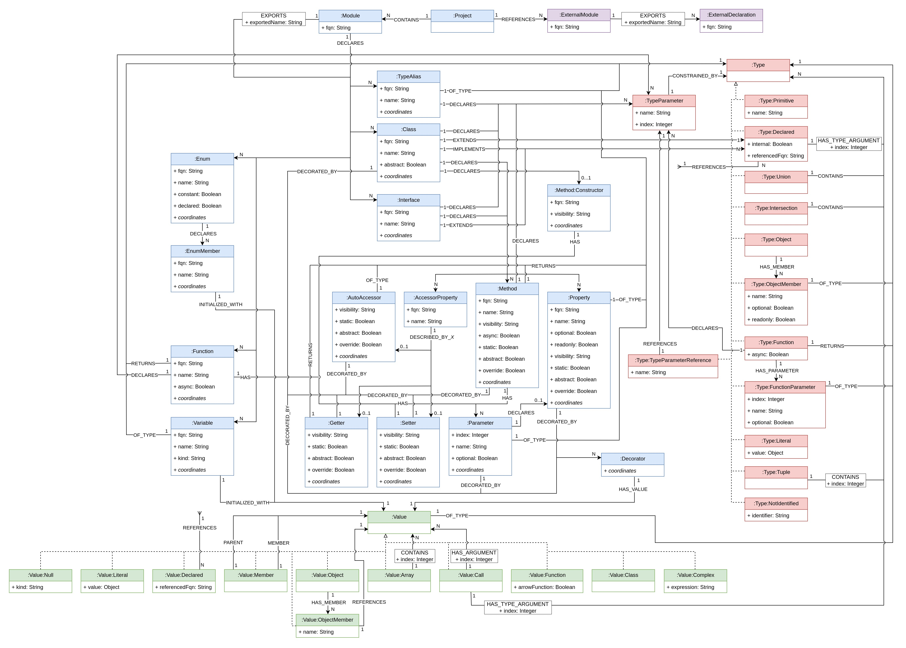

= jQAssistant TypeScript Plugin

This is the TypeScript Plugin of https://jqassistant.org[jQAssistant].
It provides a tool to extract language concepts from TypeScript code and a scanner for the resulting JSON files.

For more information on jQAssistant see https://jqassistant.org[^].

== Usage

TODO

== Model

The destinations of the `REFERENCES` relations of `:Type:Declared` and `:Value:Declared` as well as all `:DEPENDS_ON` relations have been omitted for the sake of clarity.

The `REFERENCES` relation of `:Type:Declared` can target:

* `:Class`
* `:Interface`
* `:TypeAlias`
* `:Enum`
* `:ExternalDeclaration`

The `REFERENCES` relation of `:Value:Declared` can target:

* `:Variable`
* `:Function`
* `:Class`
* `:Interface`
* `:TypeAlias`
* `:Enum`
* `:EnumMember`
* `:ExternalDeclaration`

The `DEPENDS_ON` relation can originate from:

* `:Module`
* `:Class`
* `:Property`
* `:Method`
* `:AccessorProperty`
* `:Interface`
* `:TypeAlias`
* `:Enum`
* `:Variable`
* `:Function`

and can target one or more of the following nodes:

* `:Module`
* `:Module:External`
* `:ExternalDeclaration`
* `:Class`
* `:Property`
* `:Method`
* `:AccessorProperty`
* `:Interface`
* `:TypeAlias`
* `:Enum`
* `:Variable`
* `:Function`
