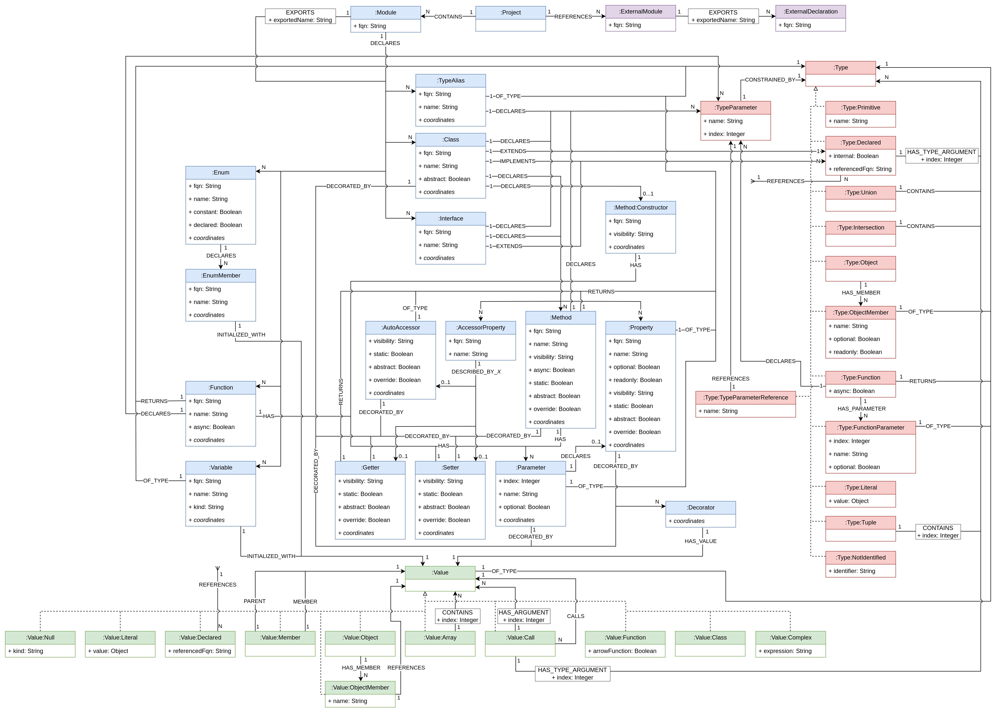
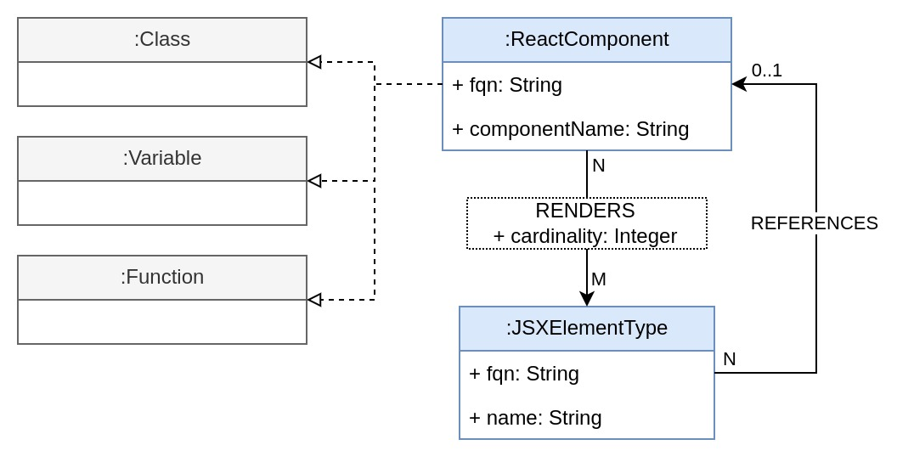

= jQAssistant TypeScript Plugin

This is the TypeScript Plugin of https://jqassistant.org[jQAssistant].
It provides a tool to extract language concepts from TypeScript code and a scanner for the resulting JSON files.

For more information on jQAssistant see https://jqassistant.org[^].

NOTE: This plugin has not been officially released yet.

== Installation

- Download the https://repo1.maven.org/maven2/com/buschmais/jqassistant/cli/jqassistant-commandline-distribution/[ZIP distribution] of the jQAssistant command line utility and unpack it. A directory `jqassistant-commandline-distribution-2.x.x` will be created.

=== NPM Installation (global):

* run `npm install --global  @jqassistant/ts-lce`

=== NPM Installation (local):

* Run `npm install --save-dev  @jqassistant/ts-lce`
* Add the following section to the `package.json` (add additional options as needed)
+
----
"scripts": {
    "jqa": "jqa-ts-lce"
}
----

== Usage

* create a file `.jqassistant.yml` in the directory that contains your project(s)
+
----
jqassistant:
  plugins:
    - group-id: org.jqassistant.plugin.typescript
      artifact-id: jqassistant-typescript-plugin
      version: 1.0.0-RC1
  scan:
    include:
      files:
        - typescript:project::build/jqa-ts-output.json
----
* execute `jqa-ts-lce`(global installation) or `npm run jqa`(local installation) from the directory that contains your project(s) (this will generate a file `.reports/jqa/ts-output.json`)
** use `--help` option to show available options for the command (when using local installation, options have to be specified in the `package.json`)
* run the jQAssistant command line utility using `jqassistant-commandline-distribution-2.x.x/bin/jqassistant.sh scan` (imports `.reports/jqa/ts-output.json` into the graph database)
* start exploring the graph by starting the embedded server `jqassistant-commandline-distribution-2.x.x/bin/jqassistant.sh server` and opening your browser at `http://localhost:7474`
- to exclude unwanted scans of directories like `node_modules` you can exclude them in the `jqassistant.yml`:
+
----
jqassistant:
  scan:
    properties:
      file.exclude:
        - /node_modules/**
        - /dist/**
        - /jqassistant/**
----

== Model

=== Core

The core model represents all basic TypeScript language concepts, independent of any used frameworks or libraries.

The destinations of the `REFERENCES` relations of `:Type:Declared` and `:Value:Declared` as well as all `:DEPENDS_ON` relations have been omitted for the sake of clarity.

The `REFERENCES` relation of `:Type:Declared` can target:

* `:Class`
* `:Interface`
* `:TypeAlias`
* `:Enum`
* `:ExternalDeclaration`

The `REFERENCES` relation of `:Value:Declared` can target:

* `:Variable`
* `:Function`
* `:Class`
* `:Interface`
* `:TypeAlias`
* `:Enum`
* `:EnumMember`
* `:ExternalDeclaration`

The `DEPENDS_ON` relation can originate from:

* `:Module`
* `:Class`
* `:Property`
* `:Method`
* `:AccessorProperty`
* `:Interface`
* `:TypeAlias`
* `:Enum`
* `:Variable`
* `:Function`

and can target one or more of the following nodes:

* `:Module`
* `:Module:External`
* `:ExternalDeclaration`
* `:Class`
* `:Property`
* `:Method`
* `:AccessorProperty`
* `:Interface`
* `:TypeAlias`
* `:Enum`
* `:Variable`
* `:Function`

==== Project and Directory Structure
* the directory provided to the language concept extractor is scanned for TypeScript projects
** each project that is discovered is associated with two `:File:Local` nodes:
*** the path to the `tsconfig.json`
*** the resolved root directory of the project (either the directory of the `tsconfig.json` or the https://www.typescriptlang.org/tsconfig#rootDir[rootDir] path, if it located above the `tsconfig.json` path)
** projects may be nested and/or https://www.typescriptlang.org/docs/handbook/project-references.html[referenced]
* all scanned files and directories are represented by `:File:Local` nodes that hold an absolute path (`absoluteFileName`) and optionally a path relative to the root of the containing project (`fileName`)
** all directories also have the additional label `:Directory`
** all scanned files and directories share a common tree of nodes (the root of this tree represents the system root directory, i.e. `/` or `C:\`)
*** NOTE: only the directory provided to the language concept extractor is fully traversed

==== References and Dependencies

* dependencies are registered on a statement/expression level and propagated upwards
** import statements are ignored during this process which means declarations of unused imports will not be represented in the graph
** the number of concrete usages within a code construct is represented by the `cardinality` property of the `DEPENDS_ON` relation
* Re-exports are resolved transitively as far as possible, that means dependencies are always targeting the original declaration, never some intermediary re-exporting module

=== React Extension

The React extension works with various concepts that represent usage patterns in the frontend framework React.

For all element types that reference some declaration, matching `DEPENDS_ON` relations are created.

== Support

This plugin should be largely compatible with all versions of TypeScript.
However, it is only developed and tested against the current version (5.1) of TypeScript.

The tool currently only supports projects using ECMAScript modules.

Currently not supported:

* old CommonJS module syntax
* triple-slash directives
